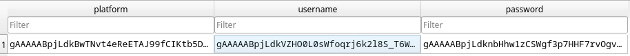
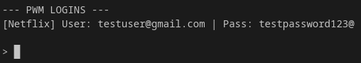

# About
pwm-sqlite3 is a password manager that uses End to End Encryption (E2EE) that manages your account credentials securely. No one other than you *including* the program itself has access to those credentials.

# Installation
1. Clone this repo or download main.py and requirements.txt separately
2. Install the libraries from requirements.txt with the specified versions.
3. Run main.py

# How to Use
Simply type `pwm` or `pwm --help` into the terminal to see the commands.

# How It Works
This program uses [end to end encryption](https://en.wikipedia.org/wiki/End-to-end_encryption) (external); meaning the program itself doesn't know your master password, and your login credentials. Your master password acts like a key for the encrypted vault created by python's built in [sqlite3](https://docs.python.org/3/library/sqlite3.html) (external). The data inside of the `PasswordManager.db` makes no sense without your master password.

FIGURE 1: Your data is gibberish to the human eyes inside of the .db file.

FIGURE 2: You can see what you actually put before once you enter your master password through the program.

### How the program checks what your master password is without knowing what it is
The program asks for your master password when you launch the program for the very first time. When yo input your password, the program stores the hashed version of your password, using your password as a "key" for hashing it. So that exact key has to be typed into the program to get to that specific hash which happens to be your master password. No one else will not have the same hashed version as you as well. Since that result is hashed together with something called "salt" making your version unique. Read more about salting in cryptography [here](https://en.wikipedia.org/wiki/Salt_(cryptography)) (external).

# The Problem (?)
This program is almost impossible to crack, except for the fact that your master password could get compromised due to the fact that your master password is saved as a variable inside of the program (stored as `globalkey`). If a hacker were to read the memory of the program, they would know your master password, therefore having access to your login credentials, albeit highly unlikely. Still, I'd recommend using this program for non-critical accounts, and not using the program for storing your banking/important info. I'd stick to established tools like Bitwarden or 1Password for high-stakes secrets. However, If an attacker is already inside your RAM, you have reached Game Over for that local machine. At that stage, they could also:
1. Install a Keylogger to record you typing the master password anyway.
2. Take Screenshots of the passwords as they appear in your screen.
3. Modify the code of your script while it's running to send the passwords to their own server.